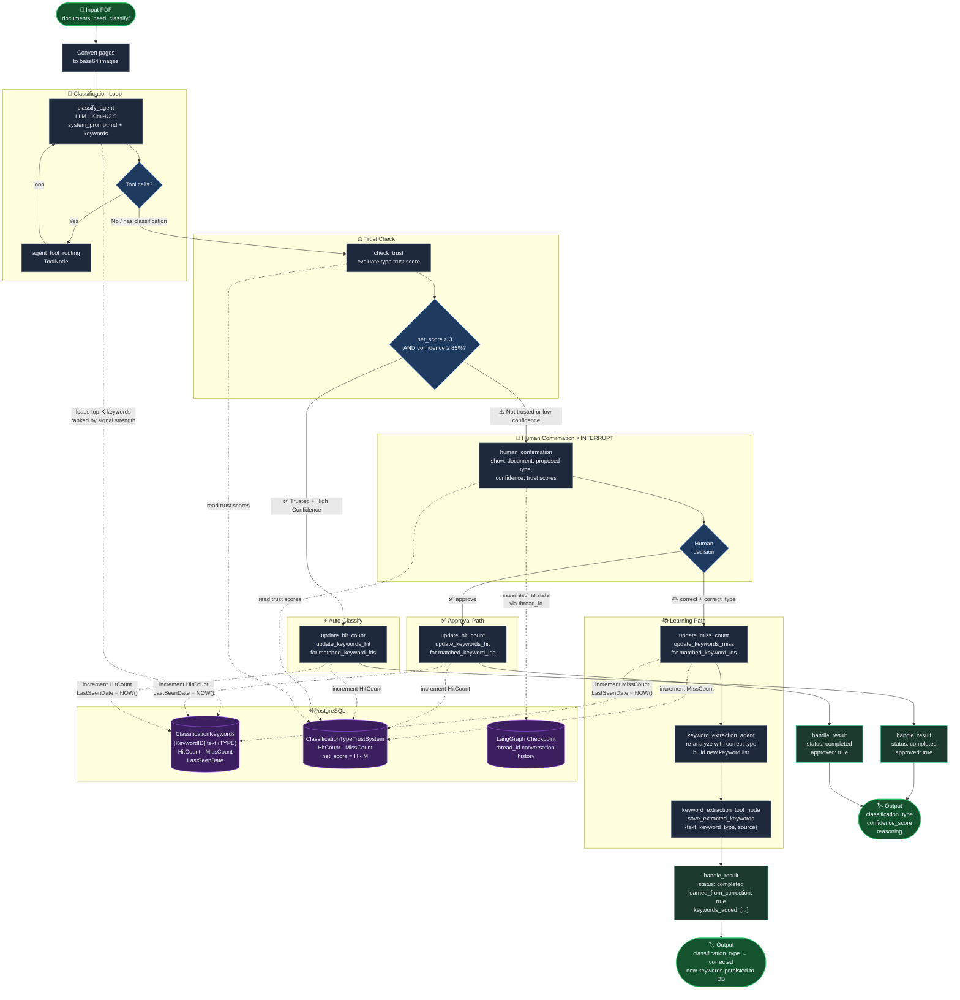

# Document Classification Agent — Workflow Diagram

Last updated: 2026-04-17



---

## Node Reference

| Node | Role |
|---|---|
| `classify_agent` | LLM node — reads system prompt + top-K keywords, calls `classify_document` tool |
| `agent_tool_routing` | Executes any tool calls the LLM made, loops back to `classify_agent` |
| `check_trust` | Reads `ClassificationTypeTrustSystem`; routes to auto-save or human review |
| `human_confirmation` | LangGraph `interrupt` — pauses graph, waits for human approve/correct |
| `keyword_extraction_agent` | Re-runs LLM with the correct type to extract distinguishing keywords |
| `keyword_extraction_tool_node` | Calls `save_extracted_keywords` to persist typed keywords to DB |
| `handle_result` | Final aggregation node before END |

## Trust Threshold

```
Auto-classify when:  (HitCount - MissCount) >= 3  AND  confidence >= 85%
Otherwise:           route to human_confirmation
```

## Learning Loop

Every human correction feeds back into `ClassificationKeywords`:
- New keywords saved with `keyword_type` + `source = HUMAN_CORRECTED`
- Matched keyword `MissCount` incremented (lowers future signal rank)
- Next classification loads updated top-K keyword list from DB